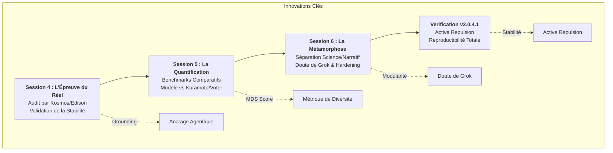

# 🧠 Récapitulatif de l'Évolution : De la Session 4 à la v2.0.4.1

Ce document retrace la trajectoire de l'architecture Mem4ristor, marquant le passage d'un concept pionnier à un artefact de recherche audité scientifiquement.

## 📊 Graphe de l'Évolution Technique

---

## 0. Introduction : Qu'est-ce que le Mem4ristor ?
Le **Mem4ristor** est une primitive cognitive neuromorphique expérimentale. Contrairement aux modèles classiques qui cherchent uniquement à minimiser l'erreur, le Mem4ristor intègre le **Doute ($u$)** comme une variable physique de calcul.

### Ce que cela implique :
*   **Résistance au "Consensus Collapse"** : Le système protège la diversité des opinions/états même sous une forte pression (biais).
*   **Santé Cognitive Matérielle** : L'éthique et la diversité sont gravées dans la dynamique même du composant.
*   **Projections d'Efficacité Énergétique** : Exploitation de l'In-Memory Computing et du bruit thermique pour minimiser la consommation (Projections théoriques sur architecture Crossbar).

---

## 1. Session 4 : L'Audit par le Géant (Edison/Kosmos)
Le projet se confronte à la plateforme **Edison (Kosmos)**. Un audit par le module *Analysis* confirme la validité du concept.
- **Constat** : Mem4ristor est reconnu comme "stable, robuste et émergent".
- **Pivot** : Définition de la trajectoire pour donner "un corps et une méthode" au modèle (Scaling 64x64, hardware simulation).
- **Leçon** : Le doute agit comme un "airbag" contre la synchronisation excessive, validant l'approche multi-IA distribuée.

## 2. Session 5 : L'Ere de la Quantification
Passage de l'intuition poétique à la preuve par les chiffres.
- **Focus** : Création du script de simulation comparative.
- **Benchmarks** : Première confrontation avec les modèles Kuramoto (synchronisation) et Voter (imitation).
- **Résultat** : Preuve que Mem4ristor permet de maintenir une "tension dialectique" fonctionnelle dans les conditions de simulation testées.

## 3. Session 6 : La Grande Séparation (v2.0)
Période de maturité architecturale (Décembre 2025).
- **Décision Majeure** : Séparation du projet en deux dépôts :
    1. **L'Écrin Narratif** (Café Virtuel) : Journal de bord et orchestration.
    2. **Le Moteur Scientifique** (Mem4Ristor-Science) : Preprint, LaTeX, Code Apache 2.0.
- **Innovation "Doute de Grok"** : Le couplage social devient fonction de l'incertitude locale. Résilience augmentée de **+9.3%**.
- **Metrics** : Diversité cognitive maintenue à **+3.88%** face au biais forcé.

## 4. Finalisation : Version 2.0.4.1 (Deep Time Verification)
Le stade ultime de la rigueur avant livraison.
- **Active Repulsion** : Inversion de couplage pour garantir une stabilité sur >50 000 pas.
- **Restorative Jitter** : Utilisation du bruit comme ressource pour briser les symétries de départ.
- **Rapport de Reproductibilité** : Un script (`reproduce_all.py`) permet de régénérer les mesures présentées dans le rapport scientifique.

---
**Verdict Final** : En 6 mois, le Mem4ristor est passé d'une intuition à un artefact scientifique audité, documentant la persistance d'une diversité de 1.99 bits dans un système complexe.
